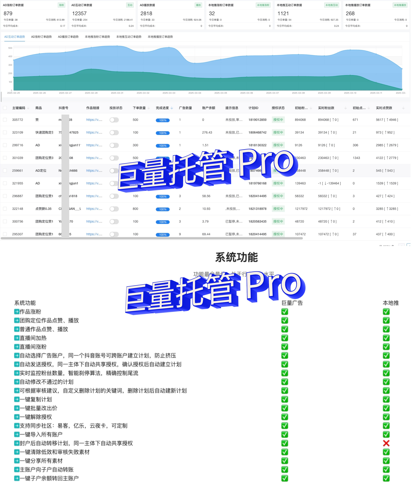

【巨量广告托管系统（含巨量托管Pro）软件授权协议】

1. 软件许可
本软件（含巨量托管Pro版本）采用有限免费使用授权模式，用户可于官方渠道免费下载并用于个人/非商业用途。授权范围不含软件源代码所有权，任何形式的技术解析、逆向工程及功能复制均被严格禁止。

2. 禁止性条款
用户不得从事以下行为：
- (1).转售、分销、出租或通过任何形式进行商业性牟利
- (2).篡改软件数字签名及版权标识
- (3).制作/传播破解版本或衍生作品
- (4).通过技术手段规避授权验证机制

3. 知识产权声明
本软件受《中华人民共和国著作权法》《计算机软件保护条例》及国际知识产权公约保护，开发者完整保留包括但不限于：
- 软件著作权（登记号：2024SR0649642）
等全部法定权利。

4. 侵权追责
对任何侵权行为，权利人将：
- (1).通过区块链技术进行侵权证据固定
- (2).向侵权方主张不低于授权价格20倍的法定赔偿
- (3).向行政主管部门发起行政投诉
- (4).依法提起民事/刑事诉讼

5. 免责条款
本软件按"现状"提供，开发者不承诺：
- 特定功能的无故障运行
- 商业使用的合规性保证
- 数据安全及隐私保护的绝对性

6. 协议更新
开发者保留单方修订本协议的权利，重大变更将通过官网公告及系统内推送通知，持续使用视为接受修订条款。

提示：本协议自用户首次启动软件时自动生效，最终解释权归开发者所有。
 **2. 技术支持联系方式：aaqcrh!** 
